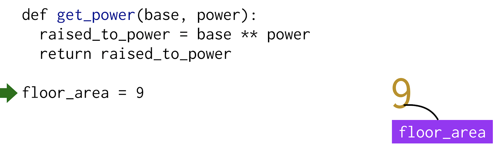

# Codexpanse styleguide

## Style

### We vs. You

#### Use 'We' when discussing processes done together

- **Yes**: We are going to implement...
- **Yes**: We have made a mistake...
- **Yes**: Our solution was good...
- No: We remember from...
- No: We were certain...

#### Use 'You' or passive voice  when teachers' part is not relevant

- **Yes**: You may remember from...
- **Yes**: You will write...
- **Yes**: It's possible to define...
- No: We remember from...
- No: We were certain...

---

## Text

### Prefer straight double quotes:

- **Yes**: "this"
- No: “this”
- No: ‘this’

### Use em-dash with spaces:

- **Yes**: My skirt wasn’t short — it was non-existent.
- No: My skirt wasn’t short—it was non-existent.
- No: My skirt wasn’t short – it was non-existent.
- No: My skirt wasn’t short - it was non-existent.

---

## Code

### Helpful comments

- Function return: `# → value`
- Print: `# →◼ text`
- Error: `# ErrorDescription`
- Equivalent values: `a ≡ b`

---

## Illustrations

### Function tables, diagrams, etc

- Font: Verdana
- Normal stroke width: 1px

### Course covers

- Size: 760x420
- Background: white
- Preferably black and white graphics

---

## Animations

### Variables created

Variables visually created when execution is on the line and expression is resolved:

### Arguments created

Argument variables visually created on the call line:

### Return

Return shows the arrow:

